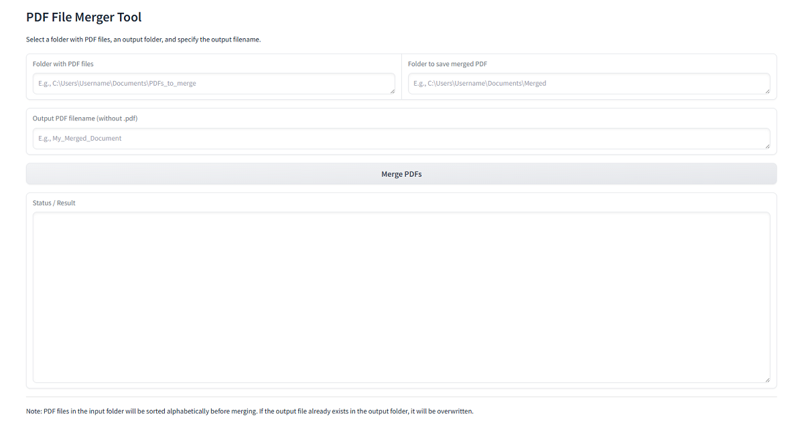

# Gradio PDF Merger

Merge multiple PDF files into one using a simple web UI powered by Python, pypdf, and Gradio.


_(Replace preview.png with an actual screenshot of the application)_

## Features

- **Simple Web Interface:** Intuitive UI created using the Gradio library.
- **Input Folder Selection:** Easily select the folder containing the PDF files to merge.
- **Output Folder Selection:** Specify where you want to save the merged PDF file.
- **Custom Output Filename:** Enter your desired name for the final document.
- **Automatic Sorting:** PDF files are automatically sorted alphabetically by filename before merging.
- **Output Folder Creation:** If the specified output folder doesn't exist, the script will attempt to create it.
- **Status Messages:** Track the progress and any potential errors directly within the user interface.
- **Output File Overwriting:** If a file with the same name already exists in the output folder, it will be overwritten.

## Requirements

- Python 3.x
- Required libraries: `pypdf` and `gradio`

## Installation

1.  **Clone the repository (or download ZIP):**

    ```bash
    git clone https://github.com/YOUR_USERNAME/Gradio-PDF-Merger.git
    cd Gradio-PDF-Merger
    ```

    _(Replace `YOUR_USERNAME` with your actual GitHub username)_

2.  **Install the required libraries:**
    ```bash
    pip install pypdf gradio
    ```
    _(Alternatively, create a `requirements.txt` file containing `pypdf` and `gradio` on separate lines and run `pip install -r requirements.txt`)_

## Usage

1.  **Run the script:**
    Open your terminal or command prompt, navigate to the project folder, and run:

    ```bash
    python main.py
    ```

    _(Make sure your Python script file is named `main.py` or adjust the command accordingly)_

2.  **Open the Web Interface:**
    The terminal will display a local URL, typically `http://127.0.0.1:7860` (or a similar port). Open this address in your web browser.

3.  **Enter Paths and Filename:**

    - In the "Folder with PDF files" field, enter the **full path** to the folder containing your PDFs.
    - In the "Folder to save merged PDF" field, enter the **full path** to the folder where you want the result saved.
    - In the "Output PDF filename" field, enter the desired name (e.g., `My_Merged_Document`). The `.pdf` extension will be added automatically if omitted.

4.  **Start Merging:**
    Click the "Merge PDFs" button (or "Spoji PDF-ove" if you haven't translated the button label in the Python code).

5.  **Check Status:**
    Monitor the "Status / Result" text area for progress updates, including found files, warnings, errors, and the final confirmation message with the location of the saved file.

## Notes

- **Merge Order:** Files are merged in **alphabetical order** based on their filenames. If you need a specific order, rename your files accordingly (e.g., `01_intro.pdf`, `02_content.pdf`, `03_appendix.pdf`).
- **Overwriting:** Be cautious, as an existing file in the output folder with the same name as your specified output filename **will be overwritten** without an additional prompt (other than the message in the status box).

## Contributing

Contributions are welcome! Feel free to open an issue or submit a pull request.
